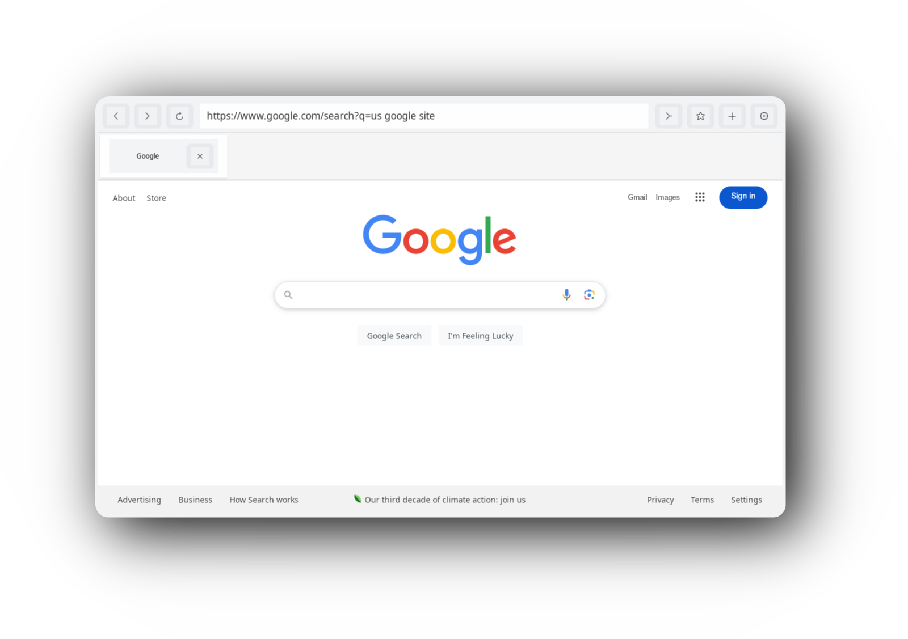
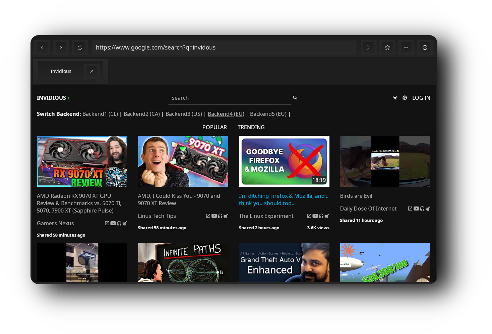

  <h2 style="font-size: 74px;">
    <strong>
      <a href="https://user7210unix.github.io/Showcase-website/" style="text-decoration: none; color: inherit;">
        EASYSURFER - WEB BROWSER
      </a>
    </strong>
  </h2>

     <!-- Creates extra space -->

<h1>
  
</h1>

  
  ## A Browser that is 🔍
 ###### Easy to use. 🍉
 ###### Loads websites fast, even on old devices. 🚀
 ###### Supports tabs for multitasking. 📑
 ###### Dark Mode Support. 🛠️
 ###### Search and explore with ease. 🔍

     <!-- Creates extra space -->

     <!-- Creates extra space -->

  <h1>
    
  </h1>

  
  ## Features 📦
 ######   Written entirely in C for efficiency and simplicity.
 ######   Designed exclusively for Linux systems. 🐧
 ######   Lightweight and fast, ideal for older hardware. ⚡
 ######   Minimal dependencies for a streamlined experience. 📦
 ######   Focused on essential features, no bloat. ✂️
 ######   Tabbed browsing for multitasking. 📑
 ######   Simple and intuitive navigation. 🍉
